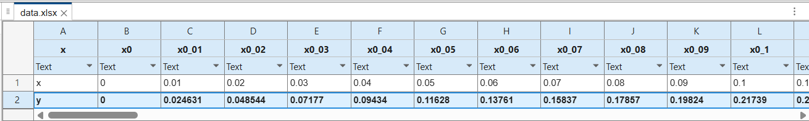

# 使用方法

## run main.m
執行 `main.m` 檔案
當前資料夾需要包含 `ENV.m` `functions.m` 附屬檔案
> [!IMPORTANT]
> 當前資料夾須包含 `output` 資料夾才會輸出資料集和圖檔

建議資料夾結構:
```
└─project            (folder)
    │  ENV.m         (file)
    │  functions.m   (file)
    │  main.m        (file)
    │
    └─output         (folder)
```
## 參數設定
> [!IMPORTANT]
> 諾設定過程中出現亂碼問題，請確定設備及MATLAB支援`UTF-8`編碼
> 

### 1. 設定進料 A mole百分率
EXAMPLE INPUT:
```
set feed A (%): 50
```
### 2. 設定塔頂期望輸出之 A mole百分率
EXAMPLE INPUT:
```
set Top A (%): 95
```
### 3. 設定塔底輸出之 A mole百分率
EXAMPLE INPUT:
```
set bottom A (%): 10
```
### 4. 設定A成分對B成分相對揮發度(α)
EXAMPLE INPUT:
```
set alpha: 2.5
```
### 5. 設定進料狀態
目前提供兩種進料狀態可供選擇
- 飽和液體
- 飽和氣體
> [!NOTE]
> 輸入項目代號

EXAMPLE INPUT:
```
===================
(1)Saturated liquid
(2)saturated gas
(3)Half [50% liquid |50% gas](待更新)
===================
set status:1
```
### 6. 設定回流比倍數
以最小回流比為基準，以設定之倍數乘上最小回流比做為精餾塔之回流比
EXAMPLE INPUT:
```
===================
RD_min x <Rate> = RD
===================
set RD rate:2
```
### 7. 設定值確認
畫面上將以視覺化圖形顯示:
```
===================
setting pre view
===================
             ├─├──────> A:95 % | B:5 %
A:50% | B:50%│ │ 
   ─────────>│ │ 
             │ │ 
             └─└──────> A:10 % | B:90 %
input 
1 to accept 
2 to reset
```
諾輸入無誤輸入`1`以繼續執行

輸入`2`以重新設定參數

## 結果輸出
console 將輸出計算後結果:
```
=======================
精餾塔理想板數: 9 板
進料板為第 5 板
=======================
```
在`output`資料夾內將生成數據集與氣液平衡圖

輸出預覽:





# LICENSE
> [MIT LICENSE](./LICENSE)
